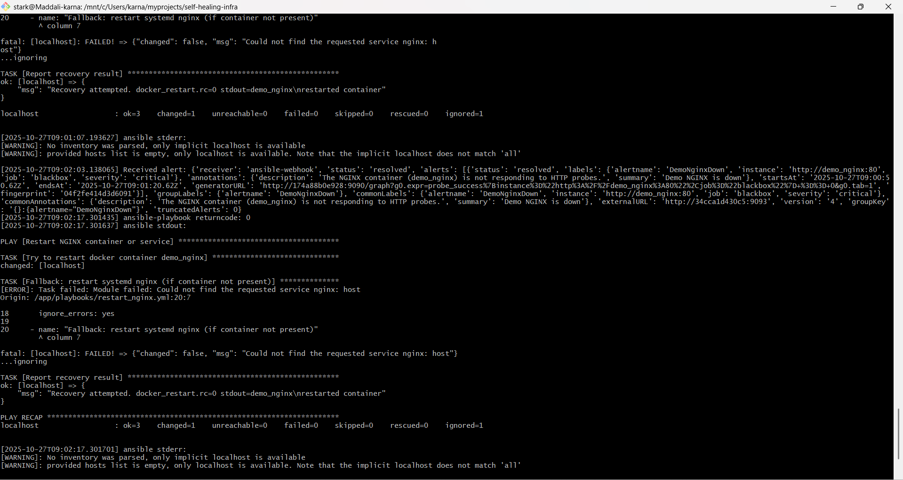

# 🛠️ Self-Healing Infrastructure using Prometheus, Alertmanager & Ansible

## 📘 Introduction
Modern production environments demand high availability and resilience. Manual intervention for service recovery often leads to downtime and operational inefficiencies.  
This project demonstrates a **Self-Healing Infrastructure** — an automated system capable of detecting failures (e.g., a stopped service or container) and triggering automated recovery actions using **Prometheus**, **Alertmanager**, and **Ansible**.

## 📄 Abstract
The objective of this project is to **detect service outages automatically** and initiate **self-healing** actions without human intervention.  
By integrating monitoring and automation tools, this project ensures continuous uptime and reduces mean time to recovery (MTTR).  

When a monitored service like **NGINX** goes down, **Prometheus** detects the failure through the **Blackbox Exporter**, **Alertmanager** sends an alert to a custom **webhook receiver**, and **Ansible** executes a recovery playbook to restart the failed service.

## 🧰 Tools Used
| Tool | Purpose |
|------|----------|
| **Prometheus** | Monitoring and alerting framework for metric collection. |
| **Alertmanager** | Manages alerts and routes them to appropriate receivers. |
| **Ansible** | Automation tool used to execute recovery playbooks. |
| **Docker** | Containerization for running Prometheus, Alertmanager, exporters, and services. |
| **Blackbox Exporter** | Probes HTTP endpoints (e.g., NGINX) to detect availability issues. |
| **Webhook Receiver (Python Flask)** | Custom endpoint to trigger Ansible automation on alerts. |
| **Ubuntu/Linux VM** | Host environment for container orchestration. |

## ⚙️ Project Architecture & Flow


## 🧩 Steps Involved in Building the Project

### 1. **Setup Monitoring**
- Deployed **Prometheus** and **Blackbox Exporter** containers using Docker.
- Configured `prometheus.yml` to monitor the `demo_nginx` endpoint on port 8080.

### 2. **Alert Configuration**
- Created an alert rule (`alert.rules.yml`) in Prometheus to trigger when probe success = 0.
- Configured **Alertmanager** with a webhook receiver endpoint.

### 3. **Webhook Receiver**
- Developed a **Python Flask** application to receive alert payloads.
- On receiving a critical alert, the Flask app logs the event and triggers an **Ansible playbook** to perform recovery actions.

### 4. **Ansible Automation**
- Wrote a playbook `restart_nginx.yml` to:
  - Check if the `demo_nginx` container is running.
  - Restart the container if it’s stopped.
  - As a fallback, restart the system-level NGINX service if the container is absent.

### 5. **Integration and Testing**
- Stopped the `demo_nginx` container manually to simulate a failure.
- Observed:
  - Prometheus detecting the outage.
  - Alertmanager firing an alert.
  - Webhook receiver logging the alert and executing the playbook.
  - NGINX container restarting automatically.

## 📊 Results
Below are screenshots demonstrating the end-to-end self-healing process:

| Stage | Description | Screenshot |
|--------|--------------|-------------|
| **1** | Prometheus detecting `probe_success=0` |  |
| **2** | Alert fired in Alertmanager |  |
| **3** | Webhook received alert and executed Ansible |  |
| **4** | Auto-recovery confirmation in Ansible logs |  |

> 🖼️ *(Place the above images in a folder named `images/` within your project directory.)*

## 🧠 Conclusion
This project successfully demonstrates **self-healing automation** for containerized infrastructure.  
By combining **Prometheus**, **Alertmanager**, and **Ansible**, the system ensures high availability and resilience, significantly reducing downtime.  
The framework can be easily extended to manage large-scale distributed systems and multiple services, making it an ideal foundation for DevOps automation in real-world deployments.

## 📁 Project Structure
```
self-healing-infra/
│
├── prometheus.yml
├── alert.rules.yml
├── alertmanager.yml
├── webhook.py
├── playbooks/
│   └── restart_nginx.yml
├── heal.log
├── Dockerfile
├── docker-compose.yml
├── README.md
└── images/
    ├── prometheus_alert.png
    ├── alertmanager_firing.png
    ├── webhook_logs.png
    └── ansible_success.png
```

## 👨‍💻 Author
**Karna Maddali**  
*DevOps & Cloud Automation Enthusiast*  
📧 [maddalikarna9.email@example.com](mailto:your.email@example.com)  
🔗 [GitHub Repository](https://github.com/KARNA-MADDALI/self-healing-infrastructure)
